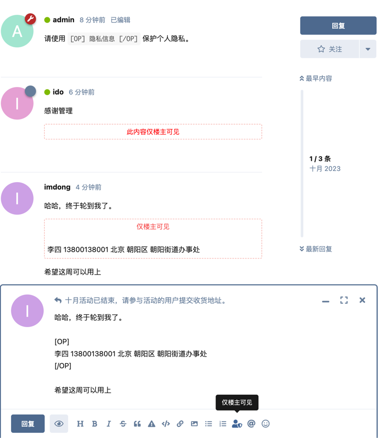

# 仅楼主可见 Visible To OP Only

 [](https://packagist.org/packages/imdong/flarum-ext-visible-to-op-only) [](https://packagist.org/packages/imdong/flarum-ext-visible-to-op-only)

A [Flarum](http://flarum.org) extension. Flarum ext Visible to OP Only

支持回复主贴时将部分内容隐藏，仅供楼主查看。



支持设置特定 tag 下隐藏回复内容（含主贴内容）。


## Installation

Install with composer:

```sh
composer require imdong/flarum-ext-visible-to-op-only:"*"
```

## Updating

```sh
composer update imdong/flarum-ext-visible-to-op-only:"*"
php flarum migrate
php flarum cache:clear
```

## Links

- [Packagist](https://packagist.org/packages/imdong/flarum-ext-visible-to-op-only)
- [GitHub](https://github.com/imdong/flarum-ext-visible-to-op-only)
- [Discuss](https://discuss.flarum.org/d/PUT_DISCUSS_SLUG_HERE)
